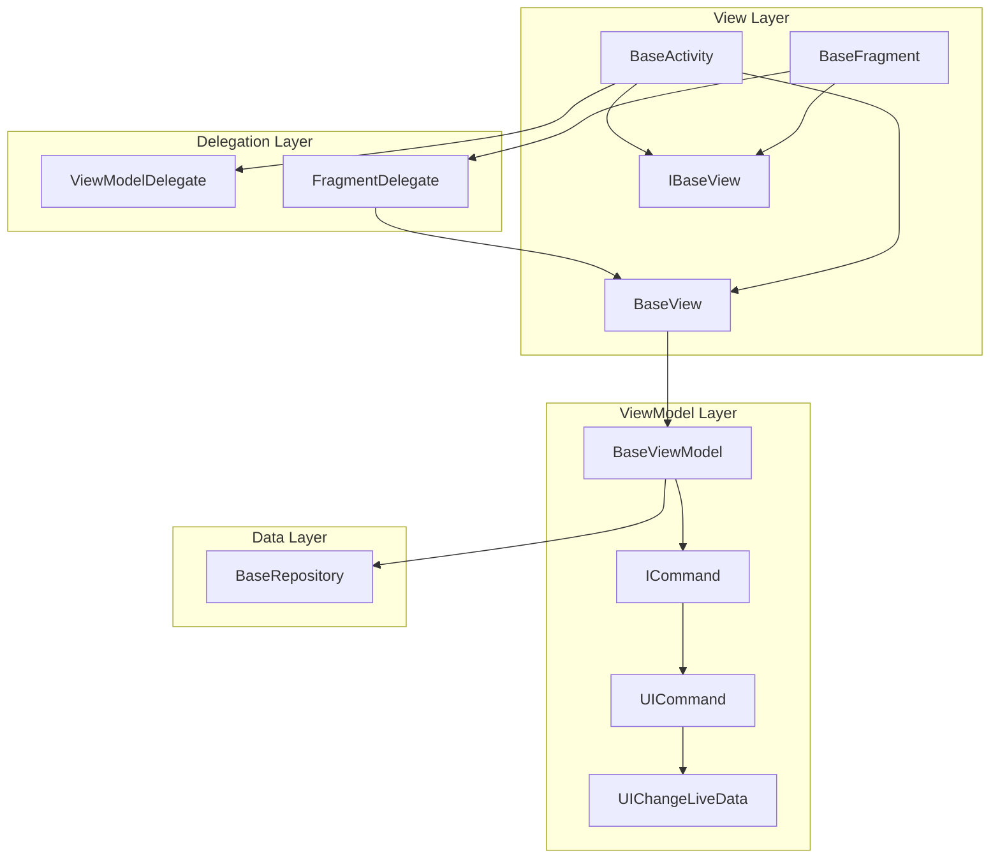
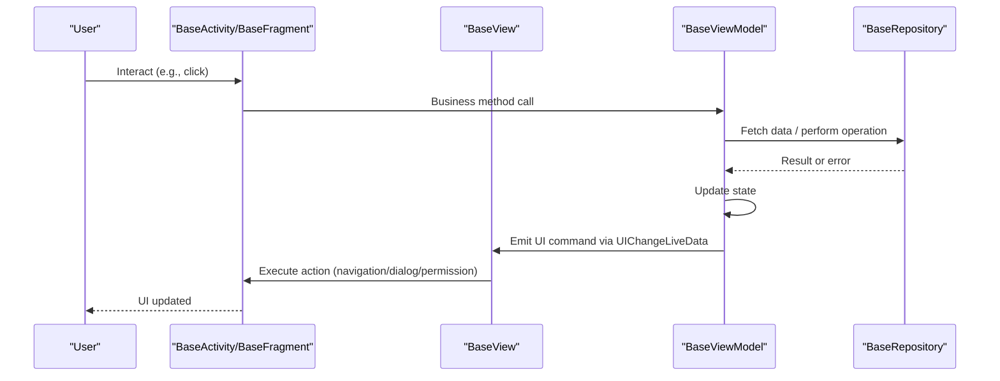
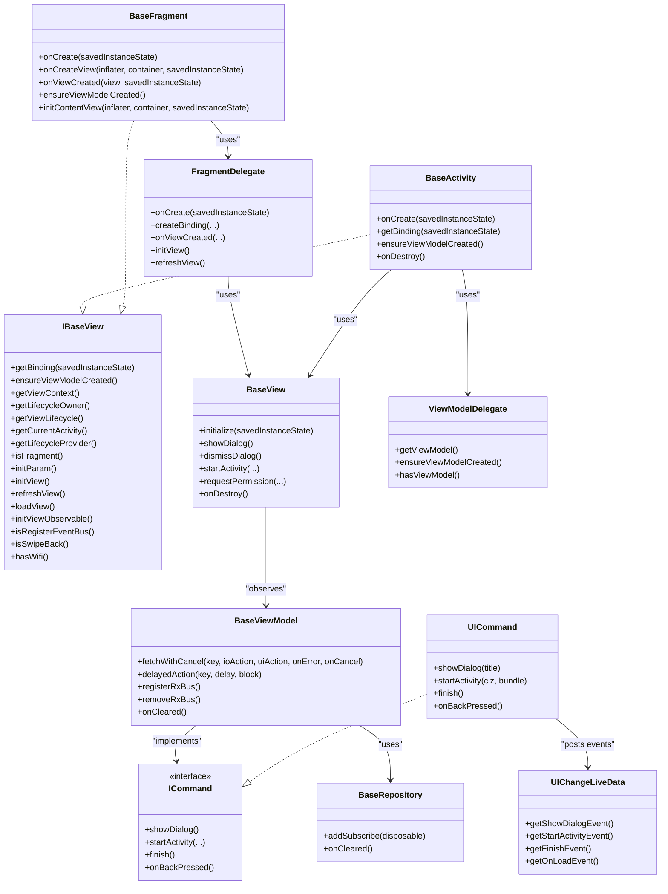
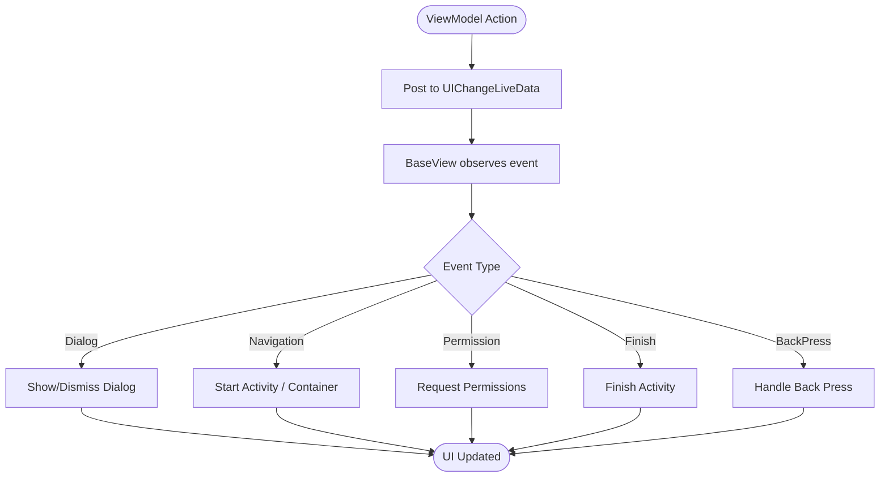
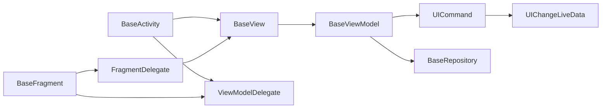

# Architecture Guide

<cite>
**Referenced Files in This Document**
- [BaseActivity.java](file://mvvm/src/main/java/com/ved/framework/base/BaseActivity.java)
- [BaseFragment.java](file://mvvm/src/main/java/com/ved/framework/base/BaseFragment.java)
- [BaseViewModel.kt](file://mvvm/src/main/java/com/ved/framework/base/BaseViewModel.kt)
- [IBaseView.java](file://mvvm/src/main/java/com/ved/framework/base/IBaseView.java)
- [BaseView.java](file://mvvm/src/main/java/com/ved/framework/base/BaseView.java)
- [ViewModelDelegate.java](file://mvvm/src/main/java/com/ved/framework/base/ViewModelDelegate.java)
- [FragmentDelegate.java](file://mvvm/src/main/java/com/ved/framework/base/FragmentDelegate.java)
- [UICommand.java](file://mvvm/src/main/java/com/ved/framework/base/UICommand.java)
- [ICommand.java](file://mvvm/src/main/java/com/ved/framework/base/ICommand.java)
- [UIChangeLiveData.java](file://mvvm/src/main/java/com/ved/framework/base/UIChangeLiveData.java)
- [IBaseViewModel.java](file://mvvm/src/main/java/com/ved/framework/base/IBaseViewModel.java)
- [BaseRepository.java](file://mvvm/src/main/java/com/ved/framework/base/BaseRepository.java)
</cite>

## Table of Contents
1. Introduction
2. Project Structure
3. Core Components
4. Architecture Overview
5. Detailed Component Analysis
6. Dependency Analysis
7. Performance Considerations
8. Troubleshooting Guide
9. Conclusion

## Introduction
This document explains the MVVM architecture implemented in this Android framework. It focuses on how View (Activity/Fragment), ViewModel, and Model collaborate through a consistent delegation pattern that enforces separation of concerns, lifecycle awareness, and robust memory management. The framework provides base classes for Activities and Fragments, a shared ViewModel base, and a command-driven UI event bus to decouple UI actions from business logic.

## Project Structure
The MVVM core resides under the base package and is composed of:
- View layer: BaseActivity, BaseFragment, IBaseView, BaseView
- ViewModel layer: BaseViewModel, ICommand, UICommand, UIChangeLiveData
- Delegation layer: ViewModelDelegate, FragmentDelegate
- Data layer: BaseRepository (and related interfaces)

**Diagram sources**
- [BaseActivity.java:22-48](file://mvvm/src/main/java/com/ved/framework/base/BaseActivity.java#L22-L48)
- [BaseFragment.java:31-76](file://mvvm/src/main/java/com/ved/framework/base/BaseFragment.java#L31-L76)
- [BaseView.java:25-60](file://mvvm/src/main/java/com/ved/framework/base/BaseView.java#L25-L60)
- [ViewModelDelegate.java:8-31](file://mvvm/src/main/java/com/ved/framework/base/ViewModelDelegate.java#L8-L31)
- [FragmentDelegate.java:27-60](file://mvvm/src/main/java/com/ved/framework/base/FragmentDelegate.java#L27-L60)
- [BaseViewModel.kt:31-51](file://mvvm/src/main/java/com/ved/framework/base/BaseViewModel.kt#L31-L51)
- [UICommand.java:12-14](file://mvvm/src/main/java/com/ved/framework/base/UICommand.java#L12-L14)
- [UIChangeLiveData.java:14-27](file://mvvm/src/main/java/com/ved/framework/base/UIChangeLiveData.java#L14-L27)
- [BaseRepository.java:11-19](file://mvvm/src/main/java/com/ved/framework/base/BaseRepository.java#L11-L19)

**Section sources**
- [BaseActivity.java:22-48](file://mvvm/src/main/java/com/ved/framework/base/BaseActivity.java#L22-L48)
- [BaseFragment.java:31-76](file://mvvm/src/main/java/com/ved/framework/base/BaseFragment.java#L31-L76)
- [BaseView.java:25-60](file://mvvm/src/main/java/com/ved/framework/base/BaseView.java#L25-L60)
- [BaseViewModel.kt:31-51](file://mvvm/src/main/java/com/ved/framework/base/BaseViewModel.kt#L31-L51)

## Core Components
- IBaseView: Unified view interface combining host capabilities, actions, and feature flags.
- BaseView: Orchestrates binding, ViewModel injection, observer setup, navigation, permissions, and EventBus registration/unregistration.
- ViewModelDelegate: Lazy creation and caching of ViewModels across Activity/Fragment.
- FragmentDelegate: Shared Fragment lifecycle and initialization logic via delegation.
- BaseViewModel: Lifecycle-aware ViewModel with coroutine job management, RxJava subscription management, and UI command facade.
- ICommand/UICommand/UIChangeLiveData: Command pattern to emit UI events as LiveData, observed by BaseView.
- BaseRepository: Disposable container for data-layer subscriptions.

Key responsibilities:
- View: Inflate layout, bind ViewModel, observe UI commands, handle navigation/dialogs/permissions.
- ViewModel: Own UI state, orchestrate data operations, expose UI commands via LiveData.
- Repository: Encapsulate data sources and manage subscriptions.

**Section sources**
- [IBaseView.java:5-12](file://mvvm/src/main/java/com/ved/framework/base/IBaseView.java#L5-L12)
- [BaseView.java:25-60](file://mvvm/src/main/java/com/ved/framework/base/BaseView.java#L25-L60)
- [ViewModelDelegate.java:8-31](file://mvvm/src/main/java/com/ved/framework/base/ViewModelDelegate.java#L8-L31)
- [FragmentDelegate.java:27-60](file://mvvm/src/main/java/com/ved/framework/base/FragmentDelegate.java#L27-L60)
- [BaseViewModel.kt:31-51](file://mvvm/src/main/java/com/ved/framework/base/BaseViewModel.kt#L31-L51)
- [ICommand.java:7-65](file://mvvm/src/main/java/com/ved/framework/base/ICommand.java#L7-L65)
- [UICommand.java:12-102](file://mvvm/src/main/java/com/ved/framework/base/UICommand.java#L12-L102)
- [UIChangeLiveData.java:14-99](file://mvvm/src/main/java/com/ved/framework/base/UIChangeLiveData.java#L14-L99)
- [BaseRepository.java:6-27](file://mvvm/src/main/java/com/ved/framework/base/BaseRepository.java#L6-L27)

## Architecture Overview
The framework implements MVVM with strong separation of concerns:
- Views (Activity/Fragment) are thin; they delegate common behavior to BaseView and FragmentDelegate.
- ViewModels own UI state and use commands to request UI changes without direct View references.
- Data flows from Repository to ViewModel, then to View via LiveData-based UI commands.

**Diagram sources**
- [BaseView.java:63-133](file://mvvm/src/main/java/com/ved/framework/base/BaseView.java#L63-L133)
- [BaseViewModel.kt:259-273](file://mvvm/src/main/java/com/ved/framework/base/BaseViewModel.kt#L259-L273)
- [UICommand.java:15-56](file://mvvm/src/main/java/com/ved/framework/base/UICommand.java#L15-L56)
- [UIChangeLiveData.java:14-99](file://mvvm/src/main/java/com/ved/framework/base/UIChangeLiveData.java#L14-L99)

## Detailed Component Analysis

### View Layer: BaseActivity and BaseFragment
- Both implement IBaseView and integrate with BaseView for binding, lifecycle, and command observation.
- BaseActivity uses ViewModelDelegate to obtain/create ViewModels and sets up DataBinding in onCreate.
- BaseFragment delegates most logic to FragmentDelegate, which creates binding and initializes BaseView during onViewCreated.

Lifecycle integration:
- BaseView.initialize binds ViewModel to ViewDataBinding, sets lifecycle owner, and observes UI commands.
- FragmentDelegate coordinates lazy loading and menu visibility for Fragment scenarios.

EventBus routing:
- Both BaseActivity and BaseFragment subscribe to EventBus events and forward them to the created ViewModel.

**Section sources**
- [BaseActivity.java:22-48](file://mvvm/src/main/java/com/ved/framework/base/BaseActivity.java#L22-L48)
- [BaseActivity.java:171-183](file://mvvm/src/main/java/com/ved/framework/base/BaseActivity.java#L171-L183)
- [BaseFragment.java:31-76](file://mvvm/src/main/java/com/ved/framework/base/BaseFragment.java#L31-L76)
- [BaseFragment.java:197-205](file://mvvm/src/main/java/com/ved/framework/base/BaseFragment.java#L197-L205)
- [FragmentDelegate.java:62-96](file://mvvm/src/main/java/com/ved/framework/base/FragmentDelegate.java#L62-L96)

### ViewModel Layer: BaseViewModel, ICommand, UICommand, UIChangeLiveData
- BaseViewModel extends AndroidViewModel and implements lifecycle callbacks, RxJava subscription management, and coroutine job management.
- UICommand exposes methods like showDialog, startActivity, finish, onBackPressed; each posts to corresponding SingleLiveEvent fields in UIChangeLiveData.
- BaseView observes these events and executes concrete View actions (navigation, dialog, permission).

Coroutine task management:
- BaseViewModel provides fetchWithCancel and delayedAction to run background tasks with key-based cancellation and automatic cleanup.

RxJava lifecycle:
- BaseViewModel holds CompositeDisposable and clears it in onCleared to prevent leaks.

**Section sources**
- [BaseViewModel.kt:31-51](file://mvvm/src/main/java/com/ved/framework/base/BaseViewModel.kt#L31-L51)
- [BaseViewModel.kt:234-273](file://mvvm/src/main/java/com/ved/framework/base/BaseViewModel.kt#L234-L273)
- [BaseViewModel.kt:337-347](file://mvvm/src/main/java/com/ved/framework/base/BaseViewModel.kt#L337-L347)
- [UICommand.java:15-56](file://mvvm/src/main/java/com/ved/framework/base/UICommand.java#L15-L56)
- [UIChangeLiveData.java:14-99](file://mvvm/src/main/java/com/ved/framework/base/UIChangeLiveData.java#L14-L99)

### Delegation Layer: ViewModelDelegate and FragmentDelegate
- ViewModelDelegate encapsulates lazy creation and caching of ViewModels, used by both Activity and Fragment.
- FragmentDelegate centralizes Fragment-specific lifecycle handling, binding creation, and data loading flow, while reusing BaseView for common View behaviors.

**Section sources**
- [ViewModelDelegate.java:8-31](file://mvvm/src/main/java/com/ved/framework/base/ViewModelDelegate.java#L8-L31)
- [FragmentDelegate.java:27-60](file://mvvm/src/main/java/com/ved/framework/base/FragmentDelegate.java#L27-L60)
- [FragmentDelegate.java:122-141](file://mvvm/src/main/java/com/ved/framework/base/FragmentDelegate.java#L122-L141)

### Data Layer: BaseRepository
- BaseRepository provides a CompositeDisposable container for data-layer subscriptions, ensuring proper cleanup when cleared.

**Section sources**
- [BaseRepository.java:6-27](file://mvvm/src/main/java/com/ved/framework/base/BaseRepository.java#L6-L27)

### Class Relationships

**Diagram sources**
- [IBaseView.java:5-12](file://mvvm/src/main/java/com/ved/framework/base/IBaseView.java#L5-L12)
- [BaseActivity.java:22-48](file://mvvm/src/main/java/com/ved/framework/base/BaseActivity.java#L22-L48)
- [BaseFragment.java:31-76](file://mvvm/src/main/java/com/ved/framework/base/BaseFragment.java#L31-L76)
- [BaseView.java:25-60](file://mvvm/src/main/java/com/ved/framework/base/BaseView.java#L25-L60)
- [ViewModelDelegate.java:8-31](file://mvvm/src/main/java/com/ved/framework/base/ViewModelDelegate.java#L8-L31)
- [FragmentDelegate.java:27-60](file://mvvm/src/main/java/com/ved/framework/base/FragmentDelegate.java#L27-L60)
- [BaseViewModel.kt:31-51](file://mvvm/src/main/java/com/ved/framework/base/BaseViewModel.kt#L31-L51)
- [ICommand.java:7-65](file://mvvm/src/main/java/com/ved/framework/base/ICommand.java#L7-L65)
- [UICommand.java:12-102](file://mvvm/src/main/java/com/ved/framework/base/UICommand.java#L12-L102)
- [UIChangeLiveData.java:14-99](file://mvvm/src/main/java/com/ved/framework/base/UIChangeLiveData.java#L14-L99)
- [BaseRepository.java:6-27](file://mvvm/src/main/java/com/ved/framework/base/BaseRepository.java#L6-L27)

### Data Flow Patterns
- ViewModel emits UI commands via UIChangeLiveData.
- BaseView observes these events and performs concrete View actions (navigation, dialogs, permissions).
- EventBus events from Activity/Fragment are forwarded to ViewModel for processing.

**Diagram sources**
- [UICommand.java:15-56](file://mvvm/src/main/java/com/ved/framework/base/UICommand.java#L15-L56)
- [BaseView.java:63-133](file://mvvm/src/main/java/com/ved/framework/base/BaseView.java#L63-L133)

### Lifecycle Management Strategies
- BaseView.initialize binds ViewModel to ViewDataBinding, sets lifecycle owner, and adds ViewModel as an observer to the View’s lifecycle.
- FragmentDelegate ensures lazy data loading based on menu visibility and load flags.
- BaseViewModel.onCleared clears subscriptions, cancels jobs, and cancels viewModelScope to prevent leaks.

**Section sources**
- [BaseView.java:45-60](file://mvvm/src/main/java/com/ved/framework/base/BaseView.java#L45-L60)
- [FragmentDelegate.java:122-141](file://mvvm/src/main/java/com/ved/framework/base/FragmentDelegate.java#L122-L141)
- [BaseViewModel.kt:337-347](file://mvvm/src/main/java/com/ved/framework/base/BaseViewModel.kt#L337-L347)

### Event Handling Architecture
- EventBus integration: BaseActivity and BaseFragment subscribe to MessageEvent and forward to ViewModel.
- RxBus/EventBus strategies: BaseViewModel selects sticky or default strategy and manages subscriptions via registerRxBus/removeRxBus.

**Section sources**
- [BaseActivity.java:171-183](file://mvvm/src/main/java/com/ved/framework/base/BaseActivity.java#L171-L183)
- [BaseFragment.java:197-205](file://mvvm/src/main/java/com/ved/framework/base/BaseFragment.java#L197-L205)
- [BaseViewModel.kt:293-335](file://mvvm/src/main/java/com/ved/framework/base/BaseViewModel.kt#L293-L335)

### ViewModel Delegation Mechanism
- ViewModelDelegate lazily creates and caches ViewModels, enabling reuse across Activity/Fragment without duplication.
- FragmentDelegate composes BaseView and ViewModelDelegate to share initialization and lifecycle logic.

**Section sources**
- [ViewModelDelegate.java:8-31](file://mvvm/src/main/java/com/ved/framework/base/ViewModelDelegate.java#L8-L31)
- [FragmentDelegate.java:27-60](file://mvvm/src/main/java/com/ved/framework/base/FragmentDelegate.java#L27-L60)

### View-Model Binding Patterns
- DataBinding: BaseView sets variable and lifecycle owner on binding after creating ViewModel.
- Command pattern: ViewModel calls UICommand methods which post to UIChangeLiveData; BaseView observes and executes View-side actions.

**Section sources**
- [BaseView.java:50-60](file://mvvm/src/main/java/com/ved/framework/base/BaseView.java#L50-L60)
- [UICommand.java:15-56](file://mvvm/src/main/java/com/ved/framework/base/UICommand.java#L15-L56)
- [BaseView.java:63-133](file://mvvm/src/main/java/com/ved/framework/base/BaseView.java#L63-L133)

## Dependency Analysis
- View depends on BaseView for binding and command observation.
- BaseView depends on BaseViewModel for UI state and commands.
- BaseViewModel depends on ICommand/UICommand/UIChangeLiveData for UI actions and on BaseRepository for data.
- Delegates reduce coupling between Activity/Fragment and shared logic.

**Diagram sources**
- [BaseActivity.java:22-48](file://mvvm/src/main/java/com/ved/framework/base/BaseActivity.java#L22-L48)
- [BaseFragment.java:31-76](file://mvvm/src/main/java/com/ved/framework/base/BaseFragment.java#L31-L76)
- [BaseView.java:25-60](file://mvvm/src/main/java/com/ved/framework/base/BaseView.java#L25-L60)
- [BaseViewModel.kt:31-51](file://mvvm/src/main/java/com/ved/framework/base/BaseViewModel.kt#L31-L51)
- [UICommand.java:12-102](file://mvvm/src/main/java/com/ved/framework/base/UICommand.java#L12-L102)
- [UIChangeLiveData.java:14-99](file://mvvm/src/main/java/com/ved/framework/base/UIChangeLiveData.java#L14-L99)
- [BaseRepository.java:6-27](file://mvvm/src/main/java/com/ved/framework/base/BaseRepository.java#L6-L27)

**Section sources**
- [BaseActivity.java:22-48](file://mvvm/src/main/java/com/ved/framework/base/BaseActivity.java#L22-L48)
- [BaseFragment.java:31-76](file://mvvm/src/main/java/com/ved/framework/base/BaseFragment.java#L31-L76)
- [BaseView.java:25-60](file://mvvm/src/main/java/com/ved/framework/base/BaseView.java#L25-L60)
- [BaseViewModel.kt:31-51](file://mvvm/src/main/java/com/ved/framework/base/BaseViewModel.kt#L31-L51)

## Performance Considerations
- Use BaseViewModel.fetchWithCancel/delayedAction to manage coroutines with key-based cancellation and automatic cleanup.
- Ensure all RxJava subscriptions are added to CompositeDisposable in ViewModel/Repository to avoid leaks.
- Avoid heavy work in View; delegate to ViewModel and update UI via LiveData commands.
- Reuse ViewModels via ViewModelDelegate to minimize instantiation overhead.

[No sources needed since this section provides general guidance]

## Troubleshooting Guide
Common issues and resolutions:
- Null binding or ViewModel: BaseView logs a critical error if either is null during initialization; verify initContentView and ensureViewModelCreated paths.
- Memory leaks: Confirm BaseViewModel.onCleared clears subscriptions and cancels jobs; ensure repositories clear disposables.
- EventBus not firing: Verify BaseView registers/unregisters EventBus targets correctly and that Activity/Fragment subscribe to events.
- Navigation not working: Check UICommand posts correct events and BaseView observers map to start activity methods.

**Section sources**
- [BaseView.java:50-60](file://mvvm/src/main/java/com/ved/framework/base/BaseView.java#L50-L60)
- [BaseView.java:151-179](file://mvvm/src/main/java/com/ved/framework/base/BaseView.java#L151-L179)
- [BaseView.java:273-299](file://mvvm/src/main/java/com/ved/framework/base/BaseView.java#L273-L299)
- [BaseViewModel.kt:337-347](file://mvvm/src/main/java/com/ved/framework/base/BaseViewModel.kt#L337-L347)

## Conclusion
This framework implements a clean MVVM architecture using delegation and command patterns to enforce separation of concerns. BaseView centralizes View responsibilities, BaseViewModel owns UI state and orchestrates data operations, and ICommand/UIChangeLiveData decouples UI actions from business logic. Lifecycle-aware components and robust memory management ensure stability and performance across Activities and Fragments.

[No sources needed since this section summarizes without analyzing specific files]