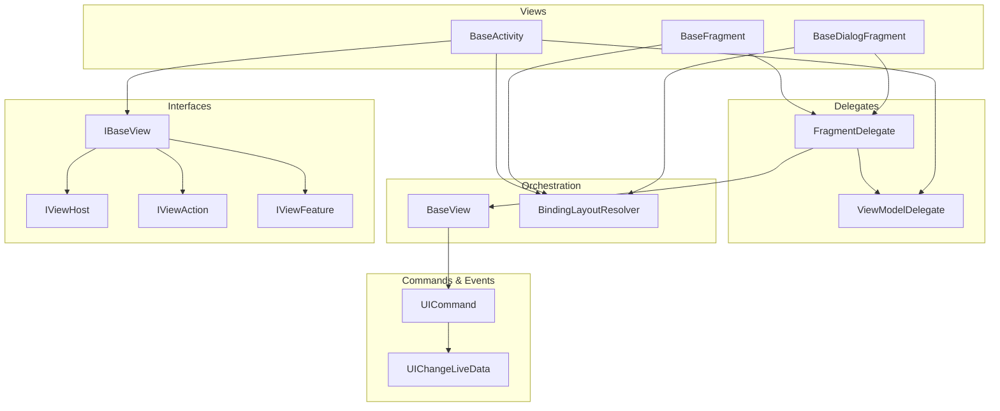
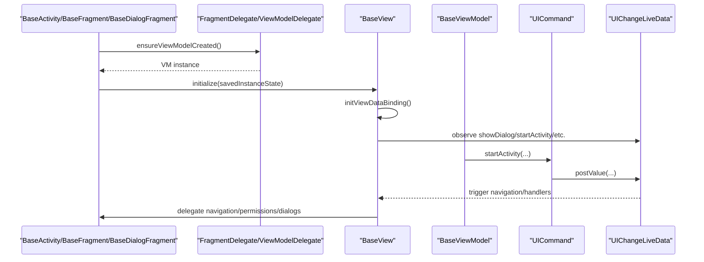
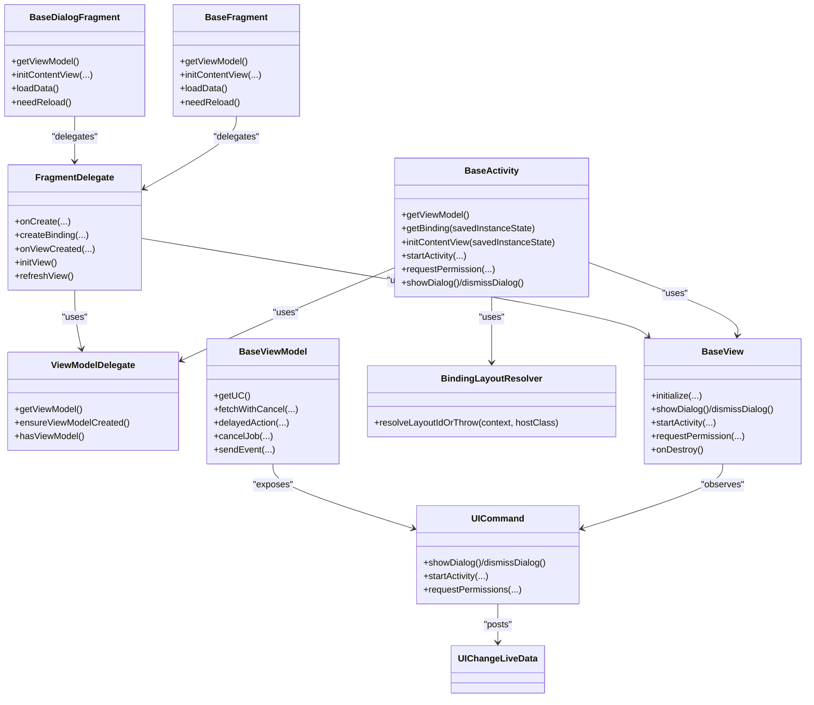

# Core Framework Components

<cite>
**Referenced Files in This Document**
- [BaseActivity.java](file://mvvm/src/main/java/com/ved/framework/base/BaseActivity.java)
- [BaseFragment.java](file://mvvm/src/main/java/com/ved/framework/base/BaseFragment.java)
- [BaseDialogFragment.java](file://mvvm/src/main/java/com/ved/framework/base/BaseDialogFragment.java)
- [BaseViewModel.kt](file://mvvm/src/main/java/com/ved/framework/base/BaseViewModel.kt)
- [BindingLayoutResolver.java](file://mvvm/src/main/java/com/ved/framework/base/BindingLayoutResolver.java)
- [BaseView.java](file://mvvm/src/main/java/com/ved/framework/base/BaseView.java)
- [FragmentDelegate.java](file://mvvm/src/main/java/com/ved/framework/base/FragmentDelegate.java)
- [ViewModelDelegate.java](file://mvvm/src/main/java/com/ved/framework/base/ViewModelDelegate.java)
- [IBaseView.java](file://mvvm/src/main/java/com/ved/framework/base/IBaseView.java)
- [IViewHost.java](file://mvvm/src/main/java/com/ved/framework/base/IViewHost.java)
- [IViewAction.java](file://mvvm/src/main/java/com/ved/framework/base/IViewAction.java)
- [IViewFeature.java](file://mvvm/src/main/java/com/ved/framework/base/IViewFeature.java)
- [UICommand.java](file://mvvm/src/main/java/com/ved/framework/base/UICommand.java)
- [UIChangeLiveData.java](file://mvvm/src/main/java/com/ved/framework/base/UIChangeLiveData.java)
</cite>

## Table of Contents
1. Introduction
2. Project Structure
3. Core Components
4. Architecture Overview
5. Detailed Component Analysis
6. Dependency Analysis
7. Performance Considerations
8. Troubleshooting Guide
9. Conclusion

## Introduction
This document explains the core framework components that power Activities, Fragments, and Dialogs with MVVM, Data Binding, and lifecycle-aware behavior. It focuses on:
- Inheritance hierarchy and responsibilities of BaseActivity, BaseFragment, BaseDialogFragment
- ViewModel integration via ViewModelDelegate and BaseViewModel
- Data binding initialization and layout resolution via BindingLayoutResolver
- Lifecycle management through BaseView and FragmentDelegate
- Public APIs for navigation, permissions, dialogs, and event bus
- Best practices, configuration options, and troubleshooting when extending these base classes

## Project Structure
The core framework is organized around a small set of cohesive components:
- View bases: BaseActivity, BaseFragment, BaseDialogFragment
- Delegates: FragmentDelegate (for fragments/dialogs), ViewModelDelegate (for view models)
- View orchestration: BaseView (binding setup, UI command observers, helpers)
- Layout resolution: BindingLayoutResolver (auto-resolve layout from Binding class)
- Command and events: UICommand + UIChangeLiveData (unidirectional UI actions)
- Interfaces: IBaseView and its role interfaces (IViewHost, IViewAction, IViewFeature)

**Diagram sources**
- [BaseActivity.java:22-61](file://mvvm/src/main/java/com/ved/framework/base/BaseActivity.java#L22-L61)
- [BaseFragment.java:31-109](file://mvvm/src/main/java/com/ved/framework/base/BaseFragment.java#L31-L109)
- [BaseDialogFragment.java:31-109](file://mvvm/src/main/java/com/ved/framework/base/BaseDialogFragment.java#L31-L109)
- [FragmentDelegate.java:27-96](file://mvvm/src/main/java/com/ved/framework/base/FragmentDelegate.java#L27-L96)
- [ViewModelDelegate.java:8-42](file://mvvm/src/main/java/com/ved/framework/base/ViewModelDelegate.java#L8-L42)
- [BaseView.java:25-146](file://mvvm/src/main/java/com/ved/framework/base/BaseView.java#L25-L146)
- [BindingLayoutResolver.java:21-83](file://mvvm/src/main/java/com/ved/framework/base/BindingLayoutResolver.java#L21-L83)
- [UICommand.java:12-102](file://mvvm/src/main/java/com/ved/framework/base/UICommand.java#L12-L102)
- [UIChangeLiveData.java:14-99](file://mvvm/src/main/java/com/ved/framework/base/UIChangeLiveData.java#L14-L99)
- [IBaseView.java:10-12](file://mvvm/src/main/java/com/ved/framework/base/IBaseView.java#L10-L12)
- [IViewHost.java:19-54](file://mvvm/src/main/java/com/ved/framework/base/IViewHost.java#L19-L54)
- [IViewAction.java:8-51](file://mvvm/src/main/java/com/ved/framework/base/IViewAction.java#L8-L51)
- [IViewFeature.java:8-40](file://mvvm/src/main/java/com/ved/framework/base/IViewFeature.java#L8-L40)

**Section sources**
- [BaseActivity.java:22-61](file://mvvm/src/main/java/com/ved/framework/base/BaseActivity.java#L22-L61)
- [BaseFragment.java:31-109](file://mvvm/src/main/java/com/ved/framework/base/BaseFragment.java#L31-L109)
- [BaseDialogFragment.java:31-109](file://mvvm/src/main/java/com/ved/framework/base/BaseDialogFragment.java#L31-L109)
- [FragmentDelegate.java:27-96](file://mvvm/src/main/java/com/ved/framework/base/FragmentDelegate.java#L27-L96)
- [ViewModelDelegate.java:8-42](file://mvvm/src/main/java/com/ved/framework/base/ViewModelDelegate.java#L8-L42)
- [BaseView.java:25-146](file://mvvm/src/main/java/com/ved/framework/base/BaseView.java#L25-L146)
- [BindingLayoutResolver.java:21-83](file://mvvm/src/main/java/com/ved/framework/base/BindingLayoutResolver.java#L21-L83)
- [UICommand.java:12-102](file://mvvm/src/main/java/com/ved/framework/base/UICommand.java#L12-L102)
- [UIChangeLiveData.java:14-99](file://mvvm/src/main/java/com/ved/framework/base/UIChangeLiveData.java#L14-L99)
- [IBaseView.java:10-12](file://mvvm/src/main/java/com/ved/framework/base/IBaseView.java#L10-L12)
- [IViewHost.java:19-54](file://mvvm/src/main/java/com/ved/framework/base/IViewHost.java#L19-L54)
- [IViewAction.java:8-51](file://mvvm/src/main/java/com/ved/framework/base/IViewAction.java#L8-L51)
- [IViewFeature.java:8-40](file://mvvm/src/main/java/com/ved/framework/base/IViewFeature.java#L8-L40)

## Core Components
- BaseActivity: Entry point for screen-level logic with Data Binding, ViewModel, navigation, permissions, and EventBus integration.
- BaseFragment and BaseDialogFragment: Shared fragment-based behavior via FragmentDelegate; both support Data Binding, ViewModel, and lifecycle hooks.
- BaseViewModel: AndroidViewModel with coroutine/job management, RxJava CompositeDisposable, UI commands, and event bus integration.
- BaseView: Orchestrates Data Binding setup, ViewModel observation, UI command handling, navigation, permissions, and resource cleanup.
- FragmentDelegate: Centralizes fragment/dialog lifecycle delegation to avoid code duplication between BaseFragment and BaseDialogFragment.
- ViewModelDelegate: Lazy creation and caching of BaseViewModel instances.
- BindingLayoutResolver: Auto-resolves layout IDs from Binding class names using reflection and caches results.
- UICommand + UIChangeLiveData: Unidirectional UI action channel from ViewModel to View via LiveData-like events.
- IBaseView and role interfaces: Clean separation of host capabilities, view actions, and feature toggles.

**Section sources**
- [BaseActivity.java:22-203](file://mvvm/src/main/java/com/ved/framework/base/BaseActivity.java#L22-L203)
- [BaseFragment.java:31-207](file://mvvm/src/main/java/com/ved/framework/base/BaseFragment.java#L31-L207)
- [BaseDialogFragment.java:31-207](file://mvvm/src/main/java/com/ved/framework/base/BaseDialogFragment.java#L31-L207)
- [BaseViewModel.kt:31-353](file://mvvm/src/main/java/com/ved/framework/base/BaseViewModel.kt#L31-L353)
- [BaseView.java:25-301](file://mvvm/src/main/java/com/ved/framework/base/BaseView.java#L25-L301)
- [FragmentDelegate.java:27-204](file://mvvm/src/main/java/com/ved/framework/base/FragmentDelegate.java#L27-L204)
- [ViewModelDelegate.java:8-43](file://mvvm/src/main/java/com/ved/framework/base/ViewModelDelegate.java#L8-L43)
- [BindingLayoutResolver.java:21-136](file://mvvm/src/main/java/com/ved/framework/base/BindingLayoutResolver.java#L21-L136)
- [UICommand.java:12-102](file://mvvm/src/main/java/com/ved/framework/base/UICommand.java#L12-L102)
- [UIChangeLiveData.java:14-99](file://mvvm/src/main/java/com/ved/framework/base/UIChangeLiveData.java#L14-L99)
- [IBaseView.java:10-12](file://mvvm/src/main/java/com/ved/framework/base/IBaseView.java#L10-L12)
- [IViewHost.java:19-54](file://mvvm/src/main/java/com/ved/framework/base/IViewHost.java#L19-L54)
- [IViewAction.java:8-51](file://mvvm/src/main/java/com/ved/framework/base/IViewAction.java#L8-L51)
- [IViewFeature.java:8-40](file://mvvm/src/main/java/com/ved/framework/base/IViewFeature.java#L8-L40)

## Architecture Overview
The framework uses a layered approach:
- View layer: BaseActivity / BaseFragment / BaseDialogFragment provide lifecycle and entry points.
- Delegation layer: FragmentDelegate and ViewModelDelegate encapsulate shared behaviors.
- Orchestration layer: BaseView wires Data Binding, ViewModel, UI commands, and helpers.
- Command layer: UICommand emits typed events via UIChangeLiveData.
- Resolution layer: BindingLayoutResolver infers layouts from Binding types.

**Diagram sources**
- [BaseActivity.java:32-47](file://mvvm/src/main/java/com/ved/framework/base/BaseActivity.java#L32-L47)
- [BaseFragment.java:42-59](file://mvvm/src/main/java/com/ved/framework/base/BaseFragment.java#L42-L59)
- [BaseDialogFragment.java:42-59](file://mvvm/src/main/java/com/ved/framework/base/BaseDialogFragment.java#L42-L59)
- [FragmentDelegate.java:65-96](file://mvvm/src/main/java/com/ved/framework/base/FragmentDelegate.java#L65-L96)
- [ViewModelDelegate.java:19-31](file://mvvm/src/main/java/com/ved/framework/base/ViewModelDelegate.java#L19-L31)
- [BaseView.java:45-146](file://mvvm/src/main/java/com/ved/framework/base/BaseView.java#L45-L146)
- [UICommand.java:27-56](file://mvvm/src/main/java/com/ved/framework/base/UICommand.java#L27-L56)
- [UIChangeLiveData.java:29-79](file://mvvm/src/main/java/com/ved/framework/base/UIChangeLiveData.java#L29-L79)

## Detailed Component Analysis

### BaseActivity
Responsibilities:
- Initializes parameters and delegates to BaseView during onCreate.
- Provides getBinding and initContentView (auto-layout resolution).
- Exposes getViewModel via ViewModelDelegate.
- Implements IBaseView methods for context, lifecycle owner, and provider.
- Integrates EventBus to forward events to ViewModel.
- Offers convenience methods for navigation, permissions, and dialog display.

Key public APIs:
- getViewModel(): returns VM instance
- getBinding(Bundle): sets content view via Data Binding and returns binding
- initContentView(Bundle): resolves layout id automatically or override to return custom layout
- startActivity(...), startActivityForResult(...), startContainerActivity(...): navigate
- requestPermission(IPermission, String...): request runtime permissions
- showDialog()/dismissDialog(): show/hide loading dialogs

Lifecycle:
- onCreate calls initParam and BaseView.initialize
- onDestroy logs and calls BaseView.onDestroy

EventBus:
- Subscribes to regular and sticky events and forwards to ViewModel if available.

**Section sources**
- [BaseActivity.java:22-203](file://mvvm/src/main/java/com/ved/framework/base/BaseActivity.java#L22-L203)

### BaseFragment and BaseDialogFragment
Shared behavior via FragmentDelegate:
- onCreate: call initParam
- onCreateView: inflate binding via FragmentDelegate.createBinding
- onViewCreated: initialize BaseView
- onDestroy: release resources via BaseView.onDestroy
- expose getViewModel via ViewModelDelegate
- provide navigation, permission, and dialog helpers
- subscribe to EventBus and forward to ViewModel

Overridable hooks:
- initContentView(LayoutInflater, ViewGroup, Bundle): auto-resolve layout by default
- loadData(): lazy load data when menu visible and first time
- needReload(): control reload behavior for tabs/fragments

Public APIs mirror BaseActivity for consistency across screens.

**Section sources**
- [BaseFragment.java:31-207](file://mvvm/src/main/java/com/ved/framework/base/BaseFragment.java#L31-L207)
- [BaseDialogFragment.java:31-207](file://mvvm/src/main/java/com/ved/framework/base/BaseDialogFragment.java#L31-L207)
- [FragmentDelegate.java:27-204](file://mvvm/src/main/java/com/ved/framework/base/FragmentDelegate.java#L27-L204)

### BaseViewModel
Responsibilities:
- Extends AndroidViewModel and implements lifecycle observer interface
- Manages RxJava subscriptions via CompositeDisposable
- Provides coroutine job management with cancelation and error handling
- Exposes UI command facade via UICommand and UIChangeLiveData
- Supports background tasks with key-based cancellation
- Integrates RxBus and EventBus with sticky/non-sticky modes

Key public APIs:
- getUC(): returns UIChangeLiveData for observing UI commands
- showDialog()/dismissDialog(): trigger UI dialogs
- startActivity(...)/startContainerActivity(...): navigate
- requestPermissions(...): request runtime permissions
- fetchWithCancel(key, ioAction, uiAction, onError, onCancel): run IO then update UI safely
- delayedAction(key, delay, block): schedule work with key-based cancellation
- cancelJob(key?, removeOnly?): cancel background jobs
- sendEvent/sendRxEvent: emit events via EventBus/RxBus
- registerRxBus/removeRxBus: manage subscription lifecycle

Lifecycle:
- onCreate/onResume: emit UI change events
- onCleared: clear disposables, cancel jobs, cancel scope

**Section sources**
- [BaseViewModel.kt:31-353](file://mvvm/src/main/java/com/ved/framework/base/BaseViewModel.kt#L31-L353)

### BindingLayoutResolver
Purpose:
- Automatically resolves layout resource ID from the first ViewDataBinding generic type parameter in the inheritance chain.
- Caches resolved IDs per host class to avoid repeated reflection and resource lookups.
- Throws a descriptive exception if layout cannot be inferred.

Usage:
- Called by default initContentView implementations in BaseActivity, BaseFragment, BaseDialogFragment.
- If your binding class does not follow naming conventions, override initContentView to return the layout id directly.

**Section sources**
- [BindingLayoutResolver.java:21-136](file://mvvm/src/main/java/com/ved/framework/base/BindingLayoutResolver.java#L21-L136)

### BaseView
Responsibilities:
- Initializes Data Binding and binds ViewModel to the view
- Observes UIChangeLiveData events and dispatches to appropriate handlers
- Coordinates navigation, permissions, dialogs, and lifecycle callbacks
- Registers/unregisters EventBus and cleans up bindings

Key flows:
- initialize: sets up binding, variables, lifecycle owner, and observers
- setupViewModelObservers: subscribes to dialog, navigation, permission, finish/back, load/resume events
- handleOnLoadEvent: triggers view initialization and optional swipe-back setup
- registerEventBusIfNeeded: registers target based on host type
- onDestroy: unbinds, removes listeners, stops wifi listening, unregisters EventBus

**Section sources**
- [BaseView.java:25-301](file://mvvm/src/main/java/com/ved/framework/base/BaseView.java#L25-L301)

### FragmentDelegate
Responsibilities:
- Encapsulates common fragment/dialog lifecycle and initialization logic
- Creates binding via host.initContentView and inflates it
- Delegates to BaseView for view setup and teardown
- Provides lazy data loading via needReload and refreshView
- Forwards EventBus events to ViewModel

**Section sources**
- [FragmentDelegate.java:27-204](file://mvvm/src/main/java/com/ved/framework/base/FragmentDelegate.java#L27-L204)

### ViewModelDelegate
Responsibilities:
- Lazily creates and caches BaseViewModel instances
- Provides ensureViewModelCreated to force instantiation
- Checks existence and retrieves created instance

**Section sources**
- [ViewModelDelegate.java:8-43](file://mvvm/src/main/java/com/ved/framework/base/ViewModelDelegate.java#L8-L43)

### UICommand and UIChangeLiveData
- UICommand exposes high-level UI actions (dialogs, navigation, permissions, finish/back) and posts them to UIChangeLiveData.
- UIChangeLiveData centralizes SingleLiveEvent instances for all UI commands and provides typed getters.

**Section sources**
- [UICommand.java:12-102](file://mvvm/src/main/java/com/ved/framework/base/UICommand.java#L12-L102)
- [UIChangeLiveData.java:14-99](file://mvvm/src/main/java/com/ved/framework/base/UIChangeLiveData.java#L14-L99)

### Interfaces: IBaseView, IViewHost, IViewAction, IViewFeature
- IBaseView composes role interfaces for clean separation of concerns.
- IViewHost defines host capabilities (context, lifecycle, activity access).
- IViewAction defines lifecycle hooks with default no-op implementations.
- IViewFeature defines feature toggles (swipe back, EventBus registration, WiFi RSSI, MVVM dialog, reload behavior).

**Section sources**
- [IBaseView.java:10-12](file://mvvm/src/main/java/com/ved/framework/base/IBaseView.java#L10-L12)
- [IViewHost.java:19-54](file://mvvm/src/main/java/com/ved/framework/base/IViewHost.java#L19-L54)
- [IViewAction.java:8-51](file://mvvm/src/main/java/com/ved/framework/base/IViewAction.java#L8-L51)
- [IViewFeature.java:8-40](file://mvvm/src/main/java/com/ved/framework/base/IViewFeature.java#L8-L40)

## Dependency Analysis

**Diagram sources**
- [BaseActivity.java:22-61](file://mvvm/src/main/java/com/ved/framework/base/BaseActivity.java#L22-L61)
- [BaseFragment.java:31-109](file://mvvm/src/main/java/com/ved/framework/base/BaseFragment.java#L31-L109)
- [BaseDialogFragment.java:31-109](file://mvvm/src/main/java/com/ved/framework/base/BaseDialogFragment.java#L31-L109)
- [FragmentDelegate.java:27-96](file://mvvm/src/main/java/com/ved/framework/base/FragmentDelegate.java#L27-L96)
- [ViewModelDelegate.java:8-43](file://mvvm/src/main/java/com/ved/framework/base/ViewModelDelegate.java#L8-L43)
- [BaseView.java:25-146](file://mvvm/src/main/java/com/ved/framework/base/BaseView.java#L25-L146)
- [BindingLayoutResolver.java:21-83](file://mvvm/src/main/java/com/ved/framework/base/BindingLayoutResolver.java#L21-L83)
- [BaseViewModel.kt:31-100](file://mvvm/src/main/java/com/ved/framework/base/BaseViewModel.kt#L31-L100)
- [UICommand.java:12-102](file://mvvm/src/main/java/com/ved/framework/base/UICommand.java#L12-L102)
- [UIChangeLiveData.java:14-99](file://mvvm/src/main/java/com/ved/framework/base/UIChangeLiveData.java#L14-L99)

**Section sources**
- [BaseActivity.java:22-61](file://mvvm/src/main/java/com/ved/framework/base/BaseActivity.java#L22-L61)
- [BaseFragment.java:31-109](file://mvvm/src/main/java/com/ved/framework/base/BaseFragment.java#L31-L109)
- [BaseDialogFragment.java:31-109](file://mvvm/src/main/java/com/ved/framework/base/BaseDialogFragment.java#L31-L109)
- [FragmentDelegate.java:27-96](file://mvvm/src/main/java/com/ved/framework/base/FragmentDelegate.java#L27-L96)
- [ViewModelDelegate.java:8-43](file://mvvm/src/main/java/com/ved/framework/base/ViewModelDelegate.java#L8-L43)
- [BaseView.java:25-146](file://mvvm/src/main/java/com/ved/framework/base/BaseView.java#L25-L146)
- [BindingLayoutResolver.java:21-83](file://mvvm/src/main/java/com/ved/framework/base/BindingLayoutResolver.java#L21-L83)
- [BaseViewModel.kt:31-100](file://mvvm/src/main/java/com/ved/framework/base/BaseViewModel.kt#L31-L100)
- [UICommand.java:12-102](file://mvvm/src/main/java/com/ved/framework/base/UICommand.java#L12-L102)
- [UIChangeLiveData.java:14-99](file://mvvm/src/main/java/com/ved/framework/base/UIChangeLiveData.java#L14-L99)

## Performance Considerations
- BindingLayoutResolver caches resolved layout IDs per host class to minimize reflection and resource lookup overhead.
- BaseView observes UIChangeLiveData once during initialization; avoid re-observing in subclasses.
- Use BaseViewModel.fetchWithCancel and delayedAction to manage coroutines and prevent leaks; always use unique keys for concurrent tasks.
- Dispose RxJava subscriptions via BaseViewModel’s CompositeDisposable; do not leak long-lived observers.
- Avoid heavy work in initView/loadData; prefer ViewModel-driven data loading.

[No sources needed since this section provides general guidance]

## Troubleshooting Guide
Common issues and resolutions:
- Cannot infer layout file:
  - Ensure your Activity/Fragment declares a concrete Binding class as the first generic type parameter.
  - If naming differs, override initContentView to return the correct layout id.
  - See exceptions thrown by layout resolution.

- Binding or ViewModel null:
  - Verify that getBinding and ensureViewModelCreated are called before accessing binding or viewModel.
  - Check that BaseView.initialize runs in onCreate/onViewCreated.

- EventBus not receiving events:
  - Enable EventBus registration via IViewFeature.isRegisterEventBus().
  - Ensure your host has @Subscribe methods and that BaseView.registerEventBusIfNeeded runs.

- Navigation not working:
  - Call UICommand.startActivity/startContainerActivity from ViewModel; BaseView will observe and execute.
  - Confirm target classes exist and bundles contain required fields.

- Permissions not requested:
  - Use UICommand.requestPermissions from ViewModel; BaseView handles the actual request flow.

- Memory leaks:
  - Ensure BaseViewModel.onCleared clears disposables and cancels jobs.
  - Avoid holding strong references to Activities/Fragments in long-lived objects.

**Section sources**
- [BindingLayoutResolver.java:45-53](file://mvvm/src/main/java/com/ved/framework/base/BindingLayoutResolver.java#L45-L53)
- [BaseView.java:45-61](file://mvvm/src/main/java/com/ved/framework/base/BaseView.java#L45-L61)
- [BaseView.java:151-179](file://mvvm/src/main/java/com/ved/framework/base/BaseView.java#L151-L179)
- [BaseView.java:273-301](file://mvvm/src/main/java/com/ved/framework/base/BaseView.java#L273-L301)
- [BaseViewModel.kt:337-347](file://mvvm/src/main/java/com/ved/framework/base/BaseViewModel.kt#L337-L347)

## Conclusion
The framework provides a robust, extensible foundation for MVVM-based Android apps:
- BaseActivity, BaseFragment, BaseDialogFragment offer consistent lifecycle and capabilities.
- FragmentDelegate and ViewModelDelegate reduce duplication and centralize behavior.
- BaseView orchestrates Data Binding, ViewModel observation, and UI commands.
- BindingLayoutResolver simplifies layout setup while allowing overrides.
- UICommand and UIChangeLiveData enforce unidirectional UI updates.
Adopting these patterns yields cleaner code, better lifecycle safety, and easier testing and maintenance.

[No sources needed since this section summarizes without analyzing specific files]