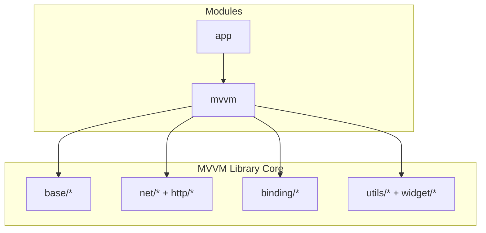
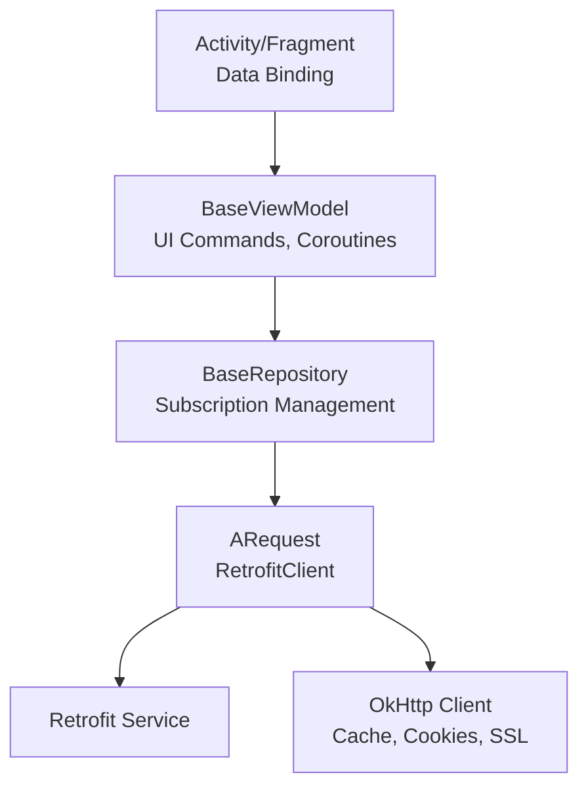
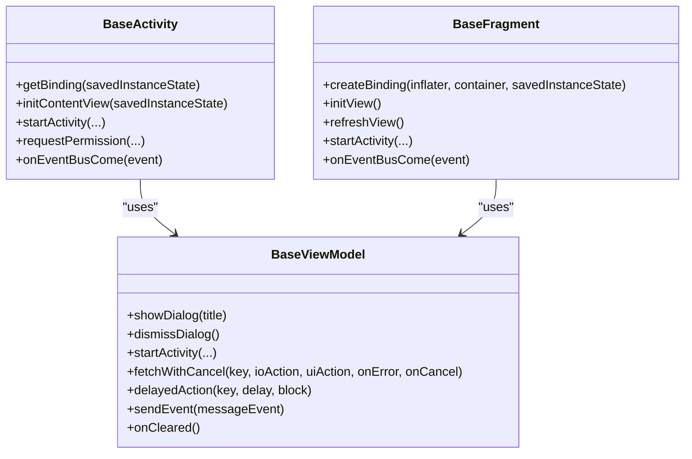
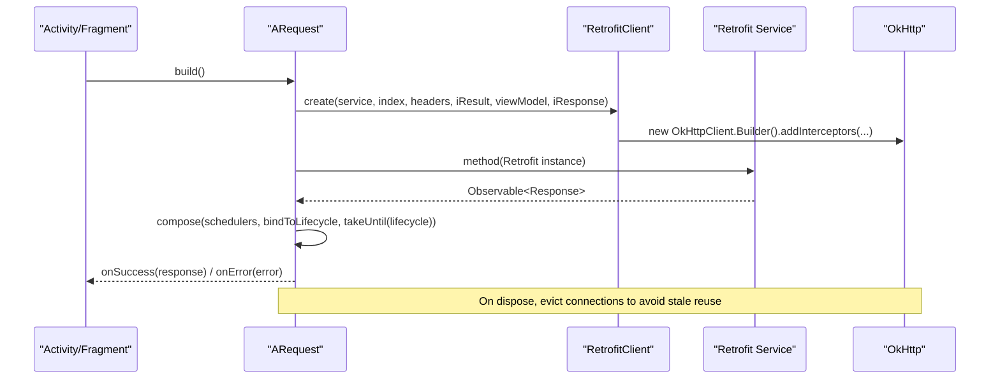
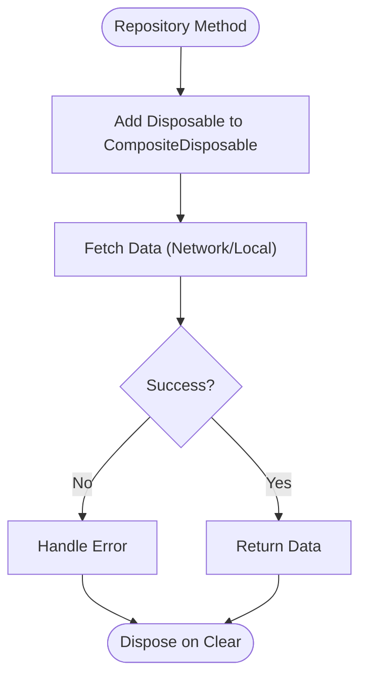
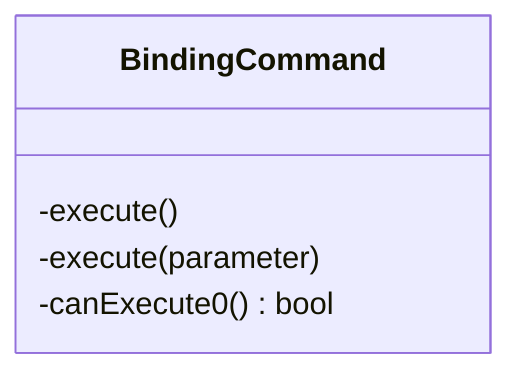
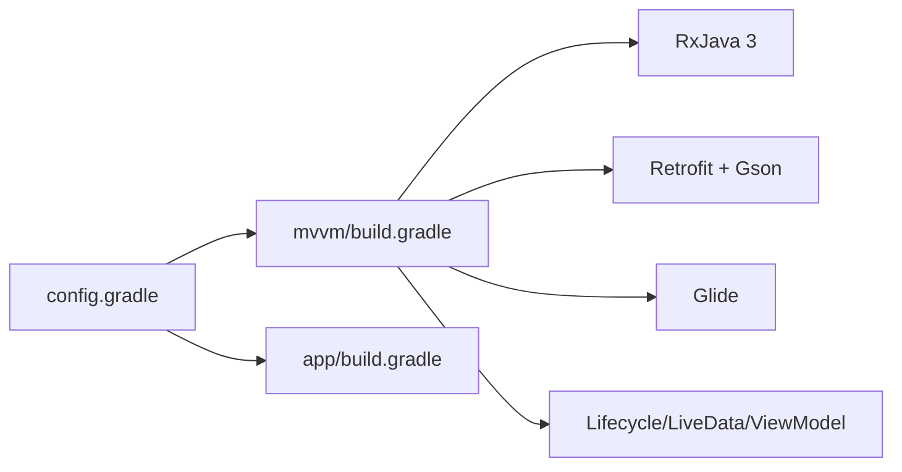

# Project Overview

<cite>
**Referenced Files in This Document**
- [README.md](file://README.md)
- [build.gradle](file://build.gradle)
- [config.gradle](file://config.gradle)
- [settings.gradle](file://settings.gradle)
- [app/build.gradle](file://app/build.gradle)
- [mvvm/build.gradle](file://mvvm/build.gradle)
- [BaseActivity.java](file://mvvm/src/main/java/com/ved/framework/base/BaseActivity.java)
- [BaseViewModel.kt](file://mvvm/src/main/java/com/ved/framework/base/BaseViewModel.kt)
- [BaseFragment.java](file://mvvm/src/main/java/com/ved/framework/base/BaseFragment.java)
- [RetrofitClient.java](file://mvvm/src/main/java/com/ved/framework/net/RetrofitClient.java)
- [ARequest.java](file://mvvm/src/main/java/com/ved/framework/net/ARequest.java)
- [BaseRepository.java](file://mvvm/src/main/java/com/ved/framework/base/BaseRepository.java)
- [BindingCommand.java](file://mvvm/src/main/java/com/ved/framework/binding/command/BindingCommand.java)
</cite>

## Table of Contents
1. [Introduction](#introduction)
2. [Project Structure](#project-structure)
3. [Core Components](#core-components)
4. [Architecture Overview](#architecture-overview)
5. [Detailed Component Analysis](#detailed-component-analysis)
6. [Dependency Analysis](#dependency-analysis)
7. [Performance Considerations](#performance-considerations)
8. [Troubleshooting Guide](#troubleshooting-guide)
9. [Conclusion](#conclusion)
10. [Appendices](#appendices)

## Introduction
This project is an Android MVVM development framework built on Data Binding and RxJava 3, designed to accelerate Android app development with a clean separation of concerns, lifecycle-aware networking, and reusable UI components. It integrates Retrofit for network calls, Glide for image loading, and Android Architecture Components (Lifecycle, LiveData, ViewModel) to provide robust, testable, and maintainable code.

Key benefits for developers:
- Less boilerplate with Data Binding and base classes for Activities/Fragments/ViewModels
- Lifecycle-aware Rx subscriptions to prevent memory leaks
- Unified request builder with automatic loading, error placeholders, and cancellation support
- Reusable view adapters and command patterns for binding-driven UI interactions
- Centralized HTTP client configuration with caching, cookies, SSL, and logging

Technology stack highlights:
- RxJava 3 and RxAndroid for reactive streams
- Retrofit 2 with Gson converter and RxJava 3 adapter
- Glide for image loading
- Android Architecture Components (Lifecycle, LiveData, ViewModel)
- OkHttp for underlying HTTP transport

## Project Structure
The project follows a two-module structure:
- app: Application module demonstrating usage and containing sample resources
- mvvm: Library module providing the core framework (base classes, networking, binding utilities, widgets, and helpers)

**Diagram sources**
- [settings.gradle:1-3](file://settings.gradle#L1-L3)
- [app/build.gradle:20-22](file://app/build.gradle#L20-L22)
- [mvvm/build.gradle:15-18](file://mvvm/build.gradle#L15-L18)

**Section sources**
- [settings.gradle:1-3](file://settings.gradle#L1-L3)
- [app/build.gradle:1-60](file://app/build.gradle#L1-L60)
- [mvvm/build.gradle:1-141](file://mvvm/build.gradle#L1-L141)

## Core Components
- Base classes for UI layer: BaseActivity, BaseFragment, BaseDialogFragment
- ViewModel base: BaseViewModel with lifecycle management, coroutine helpers, and UI command facade
- Repository base: BaseRepository for data layer subscription management
- Networking: ARequest chain builder, RetrofitClient singleton with OkHttp configuration
- Binding commands: BindingCommand for declarative UI actions
- Utilities: Glide integration, permission handling, bus/eventing, crash handling, update manager

These components work together to deliver a cohesive MVVM experience with minimal setup and consistent behavior across screens.

**Section sources**
- [BaseActivity.java:22-61](file://mvvm/src/main/java/com/ved/framework/base/BaseActivity.java#L22-L61)
- [BaseFragment.java:31-109](file://mvvm/src/main/java/com/ved/framework/base/BaseFragment.java#L31-L109)
- [BaseViewModel.kt:31-51](file://mvvm/src/main/java/com/ved/framework/base/BaseViewModel.kt#L31-L51)
- [BaseRepository.java:11-27](file://mvvm/src/main/java/com/ved/framework/base/BaseRepository.java#L11-L27)
- [ARequest.java:36-100](file://mvvm/src/main/java/com/ved/framework/net/ARequest.java#L36-L100)
- [RetrofitClient.java:64-81](file://mvvm/src/main/java/com/ved/framework/net/RetrofitClient.java#L64-L81)
- [BindingCommand.java:8-74](file://mvvm/src/main/java/com/ved/framework/binding/command/BindingCommand.java#L8-L74)

## Architecture Overview
The framework implements a layered MVVM architecture:
- View Layer: Activities/Fragments using Data Binding and base classes
- ViewModel Layer: Business logic, state, and coordination via BaseViewModel
- Repository/Network Layer: Data access through BaseRepository and ARequest with RetrofitClient

**Diagram sources**
- [BaseActivity.java:22-61](file://mvvm/src/main/java/com/ved/framework/base/BaseActivity.java#L22-L61)
- [BaseFragment.java:31-109](file://mvvm/src/main/java/com/ved/framework/base/BaseFragment.java#L31-L109)
- [BaseViewModel.kt:31-51](file://mvvm/src/main/java/com/ved/framework/base/BaseViewModel.kt#L31-L51)
- [BaseRepository.java:11-27](file://mvvm/src/main/java/com/ved/framework/base/BaseRepository.java#L11-L27)
- [ARequest.java:36-100](file://mvvm/src/main/java/com/ved/framework/net/ARequest.java#L36-L100)
- [RetrofitClient.java:64-81](file://mvvm/src/main/java/com/ved/framework/net/RetrofitClient.java#L64-L81)

## Detailed Component Analysis

### Base Classes and Lifecycle Integration
- BaseActivity provides Data Binding setup, ViewModel delegation, navigation helpers, and event bus integration. It resolves layout automatically based on binding class naming conventions.
- BaseFragment mirrors Activity behavior for Fragments, delegating lifecycle and binding creation to FragmentDelegate.
- BaseViewModel manages Rx subscriptions, coroutines, UI commands, and lifecycle events. It exposes methods to show/dismiss dialogs, navigate, request permissions, and run background tasks safely.

**Diagram sources**
- [BaseActivity.java:22-61](file://mvvm/src/main/java/com/ved/framework/base/BaseActivity.java#L22-L61)
- [BaseFragment.java:31-109](file://mvvm/src/main/java/com/ved/framework/base/BaseFragment.java#L31-L109)
- [BaseViewModel.kt:31-51](file://mvvm/src/main/java/com/ved/framework/base/BaseViewModel.kt#L31-L51)

**Section sources**
- [BaseActivity.java:22-61](file://mvvm/src/main/java/com/ved/framework/base/BaseActivity.java#L22-L61)
- [BaseFragment.java:31-109](file://mvvm/src/main/java/com/ved/framework/base/BaseFragment.java#L31-L109)
- [BaseViewModel.kt:31-51](file://mvvm/src/main/java/com/ved/framework/base/BaseViewModel.kt#L31-L51)

### Networking with ARequest and RetrofitClient
- ARequest provides a fluent API to configure requests: service interface, method lambda, loading states, placeholder views, headers, and response callbacks. It returns a PublishSubject to cancel requests at any time.
- RetrofitClient builds a singleton OkHttpClient with cache, cookie persistence, SSL, timeouts, connection pooling, and interceptors for logging and business code parsing. It creates Retrofit instances per service with RxJava 3 adapter and Gson converter.

**Diagram sources**
- [ARequest.java:98-162](file://mvvm/src/main/java/com/ved/framework/net/ARequest.java#L98-L162)
- [RetrofitClient.java:64-81](file://mvvm/src/main/java/com/ved/framework/net/RetrofitClient.java#L64-L81)
- [RetrofitClient.java:128-141](file://mvvm/src/main/java/com/ved/framework/net/RetrofitClient.java#L128-L141)

**Section sources**
- [ARequest.java:36-162](file://mvvm/src/main/java/com/ved/framework/net/ARequest.java#L36-L162)
- [RetrofitClient.java:64-141](file://mvvm/src/main/java/com/ved/framework/net/RetrofitClient.java#L64-L141)

### Data Layer with BaseRepository
- BaseRepository encapsulates CompositeDisposable to manage Rx subscriptions from data sources (network/local). Subclasses implement data fetching logic and add subscriptions to the container; clearing disposes all subscriptions to prevent leaks.

**Diagram sources**
- [BaseRepository.java:11-27](file://mvvm/src/main/java/com/ved/framework/base/BaseRepository.java#L11-L27)

**Section sources**
- [BaseRepository.java:11-27](file://mvvm/src/main/java/com/ved/framework/base/BaseRepository.java#L11-L27)

### Binding Commands for Declarative UI Actions
- BindingCommand supports action execution with optional canExecute conditions, enabling safe and conditional UI interactions bound directly from XML or code.

**Diagram sources**
- [BindingCommand.java:8-74](file://mvvm/src/main/java/com/ved/framework/binding/command/BindingCommand.java#L8-L74)

**Section sources**
- [BindingCommand.java:8-74](file://mvvm/src/main/java/com/ved/framework/binding/command/BindingCommand.java#L8-L74)

## Dependency Analysis
Centralized dependency versions are managed in config.gradle and applied across modules. The mvvm library exposes APIs for RxJava, Retrofit, Glide, and Android Architecture Components, while the app module demonstrates usage and includes additional runtime dependencies.

**Diagram sources**
- [config.gradle:30-67](file://config.gradle#L30-L67)
- [mvvm/build.gradle:50-141](file://mvvm/build.gradle#L50-L141)
- [app/build.gradle:47-59](file://app/build.gradle#L47-L59)

**Section sources**
- [config.gradle:30-67](file://config.gradle#L30-L67)
- [mvvm/build.gradle:50-141](file://mvvm/build.gradle#L50-L141)
- [app/build.gradle:47-59](file://app/build.gradle#L47-L59)

## Performance Considerations
- Connection pooling and cache reuse via OkHttp reduce latency and improve throughput.
- Global base OkHttpClient ensures shared resources (SSL, cookies, cache) are reused across requests.
- Evicting idle connections after request cancellation prevents stale socket reuse issues when retrying immediately.
- Coroutine-based background tasks in BaseViewModel ensure efficient thread switching and cancellation.
- Data Binding reduces manual view updates and minimizes UI overhead.

[No sources needed since this section provides general guidance]

## Troubleshooting Guide
Common issues and resolutions:
- Network request cancellation interference: If you cancel a request and immediately retry, ensure you use the provided lifecycle subject to avoid old errors interfering with new requests. The framework handles cancellation exceptions gracefully.
- Placeholder views not showing: Ensure viewState and seat success/error callbacks are configured in ARequest.
- Permission requests: Use BaseViewModel.requestPermissions or BaseActivity.requestPermission to handle runtime permissions consistently.
- Image loading: Configure Glide properly and ensure proper context usage.

**Section sources**
- [ARequest.java:194-253](file://mvvm/src/main/java/com/ved/framework/net/ARequest.java#L194-L253)
- [RetrofitClient.java:207-253](file://mvvm/src/main/java/com/ved/framework/net/RetrofitClient.java#L207-L253)

## Conclusion
This MVVM framework streamlines Android development by combining Data Binding, RxJava 3, Retrofit, Glide, and Android Architecture Components into a cohesive, lifecycle-aware system. With base classes, unified networking, and reusable UI primitives, it reduces boilerplate, improves reliability, and accelerates feature delivery.

[No sources needed since this section summarizes without analyzing specific files]

## Appendices

### Installation and Setup Requirements
- Android Studio with Gradle plugin 4.0.2+
- Java 8 compatibility enabled
- Modules: include ':mvvm' and ':app' in settings.gradle
- Enable Data Binding in both app and mvvm modules

**Section sources**
- [build.gradle:22-28](file://build.gradle#L22-L28)
- [settings.gradle:1-3](file://settings.gradle#L1-L3)
- [app/build.gradle:20-27](file://app/build.gradle#L20-L27)
- [mvvm/build.gradle:15-18](file://mvvm/build.gradle#L15-L18)

### Quick Start Guide
1. Extend BaseActivity or BaseFragment and implement initContentView to set up Data Binding.
2. Create a ViewModel extending BaseViewModel to manage state and business logic.
3. Use ARequest to define network calls with chaining for service, method, loading, and response handling.
4. Bind UI elements using Data Binding expressions and BindingCommand for actions.
5. Leverage BaseRepository for data layer operations with automatic subscription management.

**Section sources**
- [BaseActivity.java:22-61](file://mvvm/src/main/java/com/ved/framework/base/BaseActivity.java#L22-L61)
- [BaseFragment.java:31-109](file://mvvm/src/main/java/com/ved/framework/base/BaseFragment.java#L31-L109)
- [ARequest.java:36-100](file://mvvm/src/main/java/com/ved/framework/net/ARequest.java#L36-L100)
- [BindingCommand.java:8-74](file://mvvm/src/main/java/com/ved/framework/binding/command/BindingCommand.java#L8-L74)
- [BaseRepository.java:11-27](file://mvvm/src/main/java/com/ved/framework/base/BaseRepository.java#L11-L27)